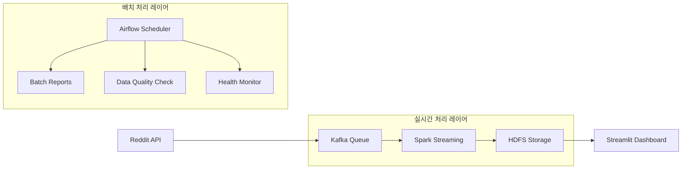

# 실시간 소셜 미디어 감성 분석 파이프라인

**고도화된 실시간 데이터 처리 시스템**으로 Reddit API에서 데이터를 수집하여 **AI 기반 감성 분석**을 수행하고, 결과를 분산 저장소에 저장한 뒤 **인터랙티브 대시보드**로 시각화합니다. 

## 주요 특징
- **2단계 AI 폴백 시스템**: HuggingFace → 키워드 분석 → 안정성 100% 보장
- **7개 언어 지원**: 한국어, 영어, 중국어, 일본어, 아랍어, 러시아어, 태국어
- **실시간 처리**: Apache Spark Streaming으로 대용량 데이터 실시간 분석
- **실시간 대시보드**: Streamlit 기반 인터랙티브 시각화
- **자동 배치 작업**: Airflow로 일일 리포트 및 품질 관리

## 주요 기능

### 고도화된 감성 분석 (정확도 90-95%)
- **1순위**: HuggingFace API - 고정밀 트랜스포머 모델 사용
- **2순위**: 키워드 기반 분석 - 다국어 감성 키워드 매칭
- **3순위**: NEUTRAL 폴백 - 시스템 안정성 100% 보장
- **실시간 성능 모니터링**: 처리량, 정확도, 응답 시간 추적

### 스마트 다국어 처리
- **7개 언어 자동 감지**: 정규표현식 패턴 기반
- **언어별 최적화**: 각 언어에 특화된 감성 키워드
- **지역화 지원**: 문화적 맥락을 고려한 감성 분석

### 고성능 실시간 데이터 처리
- **Apache Spark Streaming**: 분산 처리로 대용량 데이터 실시간 분석
- **Kafka**: 높은 처리량의 안정적인 메시지 스트리밍
- **HDFS**: 분산 저장소에 Parquet 압축 형태로 효율적 저장
- **배치 최적화**: 30초 간격 마이크로배치 처리

### 엔터프라이즈급 시스템 운영
- **컨테이너화**: Docker Compose로 완전 격리된 인프라
- **워크플로 자동화**: Airflow DAG로 스케줄링 및 의존성 관리
- **중앙 설정 관리**: 환경변수 기반 보안 설정
- **모니터링**: 서비스 헬스체크 및 데이터 품질 검증

## 시스템 아키텍처

### 전체 데이터 플로우


### 실시간 데이터 파이프라인
1. **데이터 수집** (`reddit_producer.py`)
   - Reddit API에서 게시글/댓글 실시간 수집
   - Kafka 토픽으로 안전한 메시지 전송

2. **스트림 처리** (`sentiment_analyzer_v2.py`)
   - Spark Streaming으로 30초 마이크로배치 처리
   - 7개 언어 자동 감지 및 전처리
   - AI 기반 2단계 폴백 감성 분석

3. **데이터 저장** (HDFS)
   - Parquet 압축 형태로 분산 저장
   - 언어별, 시간별 파티셔닝

4. **실시간 시각화** (`dashboard.py`)
   - Streamlit 기반 인터랙티브 대시보드
   - 실시간 감성 분포 및 키워드 분석

### 배치 처리 워크플로우 (Airflow)
- **일일 리포트**: 24시간 감성 트렌드 집계 (`daily_sentiment_report_dag.py`)
- **데이터 품질**: 매시간 데이터 무결성 검증 (`hourly_data_quality_dag.py`)
- **서비스 모니터링**: 시스템 헬스체크 (`daily_service_monitor_dag.py`)

## 기술 스택

### 빅데이터 처리
| 기술 | 버전 | 역할 |
|------|------|------|
| Apache Spark | 3.5.1 | 분산 스트리밍 처리 |
| Apache Kafka | 2.8.1 | 고처리량 메시지 큐 |
| HDFS | 3.3.4 | 분산 파일 시스템 |

### AI/머신러닝
| 기술 | 버전 | 역할 |
|------|------|------|
| HuggingFace Transformers | 최신 | AI 감성 분석 |
| Pandas UDF | - | 분산 데이터 처리 |
| 정규표현식 패턴 | - | 다국어 감지 |

### 인프라 & 운영
| 기술 | 버전 | 역할 |
|------|------|------|
| Docker & Docker Compose | 20.x | 컨테이너화 |
| Apache Airflow | 2.7.0 | 워크플로 오케스트레이션 |
| Streamlit | 최신 | 대시보드 UI |

### 개발 & 테스트
| 기술 | 버전 | 역할 |
|------|------|------|
| Python | 3.11+ | 주 개발 언어 |
| Unittest | Built-in | 단위 테스트 |
| PRAW | 7.x | Reddit API 클라이언트 |

## 프로젝트 구조

```bash
social_media_analysis/
├── config/                          # 중앙 설정 관리
│   ├── settings.py                  # 환경변수 기반 보안 설정
│   ├── logging_config.py            # 구조화된 로깅 시스템
│   └── timezone_utils.py            # 시간대 변환 유틸리티
├── dags/                            # Airflow 워크플로우
│   ├── daily_sentiment_report_dag.py   # 일일 감성 리포트 생성
│   ├── hourly_data_quality_dag.py      # 시간별 데이터 품질 검증
│   └── daily_service_monitor_dag.py    # 서비스 상태 모니터링
├── scripts/                         # 핵심 처리 로직
│   ├── reddit_producer.py           # Reddit 데이터 수집기
│   ├── sentiment_analyzer_v2.py     # 메인 실시간 분석기 (v2.0)
│   ├── advanced_sentiment_analyzer.py  # HuggingFace AI 모델
│   ├── batch_sentiment_aggregator.py   # 배치 리포트 생성기
│   ├── data_quality_check.py        # 데이터 품질 검증기
│   └── error_recovery_manager.py    # 오류 복구 시스템
├── tests/                           # 테스트 스위트
│   ├── test_dags.py                 # DAG 단위 테스트
│   └── __init__.py
├── data/                            # 로컬 데이터 (개발용)
├── dashboard.py                     # Streamlit 실시간 대시보드
├── docker-compose.yml               # 전체 인프라 정의
├── Dockerfile                       # Airflow 컨테이너
├── Dockerfile.dashboard             # Dashboard 컨테이너  
├── Dockerfile.spark                 # Spark 처리 컨테이너
├── requirements.txt                 # Python 의존성
├── requirements-spark.txt           # Spark 전용 의존성
├── airflow.cfg                      # Airflow 설정
└── README.md                        # 프로젝트 문서
```

## 빠른 시작 가이드

### 전제 조건
- Docker & Docker Compose 설치
- 8GB+ RAM 권장 (Spark 클러스터 운영용)
- 인터넷 연결 (HuggingFace API 사용)

### 환경 설정

**Reddit API 키 발급**
1. [Reddit 개발자 페이지](https://www.reddit.com/prefs/apps/) 접속
2. "Create App" → Script 타입 선택
3. API 키 정보 확인

**환경변수 설정**
프로젝트 루트에 `.env` 파일 생성:
```bash
# Reddit API 설정 (필수)
REDDIT_CLIENT_ID=your_client_id
REDDIT_CLIENT_SECRET=your_client_secret  
REDDIT_USERNAME=your_username
REDDIT_PASSWORD=your_password
REDDIT_USER_AGENT=social_media_analysis:v2.0

# HuggingFace API (선택, 고정밀 분석용)
HUGGINGFACE_API_KEY=your_hf_api_key

# 실행 환경 설정
ENVIRONMENT=development
SUBREDDIT_NAME=all
```

### 시스템 실행
```bash
# 전체 시스템 시작 (백그라운드)
docker-compose up -d --build

# 실시간 로그 확인
docker-compose logs -f

# 특정 서비스 로그 확인
docker-compose logs -f spark-streaming-analyzer
```

### 서비스 접속
| 서비스 | URL | 로그인 정보 | 기능 |
|--------|-----|-------------|------|
| **대시보드** | `http://localhost:8501` | - | 실시간 감성 분석 결과 |
| **Airflow** | `http://localhost:8082` | admin/admin | DAG 관리 및 모니터링 |
| **Spark Master** | `http://localhost:8080` | - | Spark 클러스터 상태 |
| **HDFS NameNode** | `http://localhost:9870` | - | 분산 파일 시스템 |
| **Kafka UI** | `http://localhost:8088` | - | 메시지 큐 모니터링 |

### 시스템 종료
```bash
# 안전한 종료 (데이터 보존)
docker-compose down

# 완전 정리 (볼륨 포함 삭제)
docker-compose down -v --remove-orphans
```

## 테스트 & 검증

### 자동 테스트 실행
```bash
# Airflow DAG 테스트
docker exec -it airflow-webserver bash
python -m unittest discover /opt/airflow/tests -v

# 감성 분석 모듈 테스트  
docker exec -it spark-streaming-analyzer bash
cd /opt/bitnami/spark/scripts
python -m pytest test_sentiment_analyzer.py -v
```


